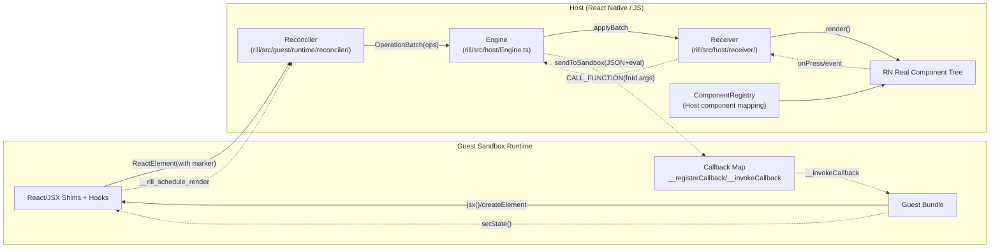
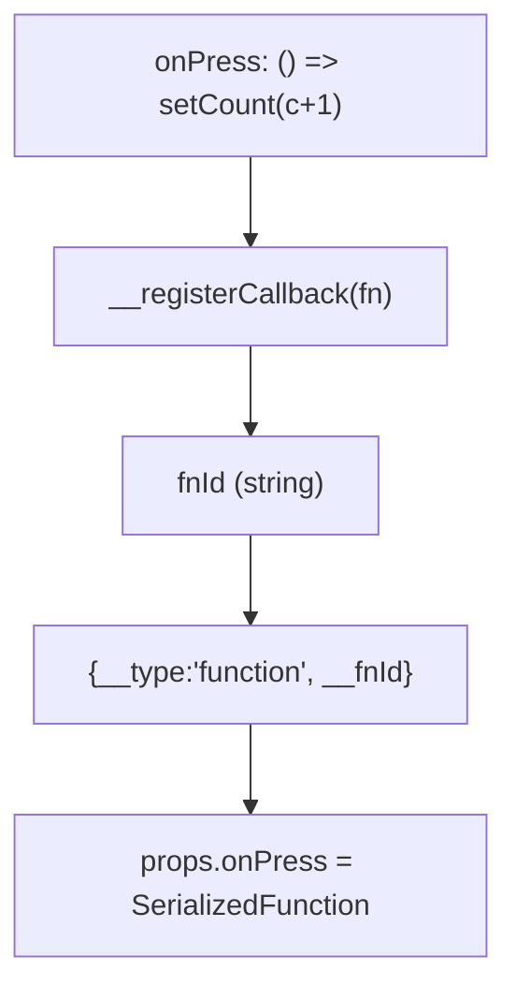
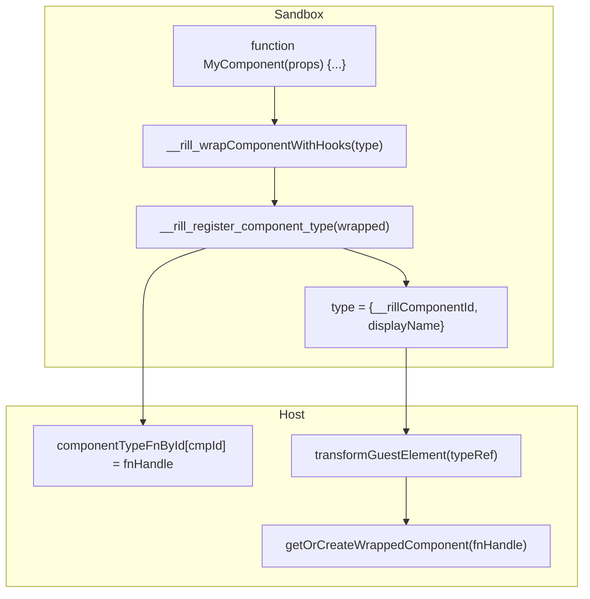
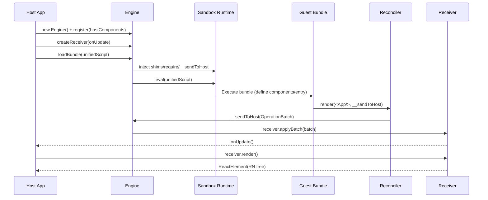
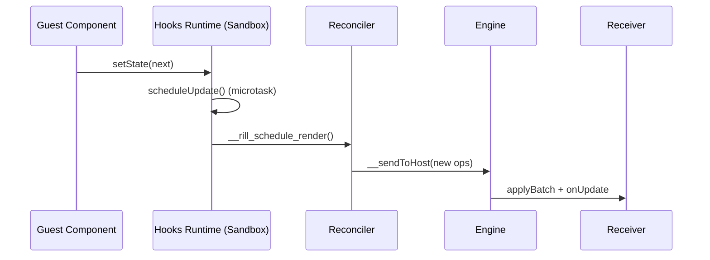
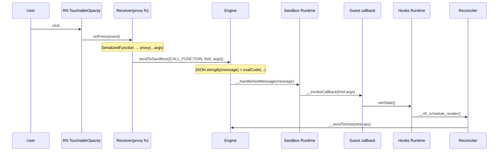
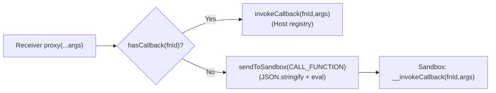

# Rill Guest ↔ Host Interaction (Rendering / Updates / Event Callbacks)

> This document focuses on how **Rill's Guest (sandbox) and Host (React Native)** accomplish:
> 1) Rendering (Guest generates UI → Host renders native components)
> 2) Updates (Guest internal state changes → Host receives incremental ops to refresh UI)
> 3) Event callbacks (Host-side clicks etc. → trigger Guest callbacks → re-render)
>
> It also explains common issues: e.g., **`JSON.stringify cannot serialize cyclic structures` causing button clicks to fail**.

---

## 0. TL;DR (30-Second Version)

- Guest runs in an isolated JS Runtime (JSC/QuickJS/VM/Worker etc. Provider), using injected **React/JSX shims** to construct "ReactElement-like" object trees.
- During rendering, the **Reconciler (custom react-reconciler renderer)** transforms Guest's element tree into **OperationBatch (ops list)**, sent to Host via `__sendToHost(batch)`.
- Host's **Receiver** restores ops into a "renderable RN component tree", handed to RN for rendering.
- Host-side event callbacks (like `onPress`) don't directly pass functions across engines, but use `{__type:'function', __fnId}` "function references" to execute back in Guest:
  - Host calls `sendToSandbox({type:'CALL_FUNCTION', fnId, args})`
  - Guest executes `__invokeCallback(fnId, args)`, callback triggers `setState`
  - `setState` requests re-render via `__rill_schedule_render()`, producing new ops
- **Key constraint**: Current Host→Guest message channel uses `JSON.stringify(message)` into `eval(...)`, so `args/payload` must be **JSON serializable**; RN event objects often contain circular references, which will break the click chain if passed directly.

---

## 1. Roles and Boundaries (Who's in Which Process/Engine)

| Role | Side | Responsibility | Typical Location |
|---|---|---|---|
| Host App | RN/Host JS | Create Engine, register components, display UI, forward clicks etc. to Guest | App integration code |
| Engine | Host | Manage sandbox runtime, inject globals, execute bundle, send/receive messages | `rill/src/host/Engine.ts` |
| Receiver | Host | Receive ops, maintain nodeMap, render to RN ReactElement, bridge event callbacks | `rill/src/host/receiver/` |
| Reconciler | (Logically) Bridge layer | Transform element tree → ops (CREATE/UPDATE/APPEND…) | `rill/src/guest/runtime/reconciler/` |
| Guest runtime | Sandbox | Execute Guest bundle, store hooks state, run callbacks | `rill/src/guest/` + guest bundle |

---

## 2. Two "Communication Channels" (Different Directions, Different Constraints)

### 2.1 Sandbox → Host: `__sendToHost(batch)` (High frequency, minimal loss)

- Guest/renderer packages ops into `OperationBatch` during commit phase.
- Calls `__sendToHost` (function injected by Host into sandbox) to callback directly to Host (Provider/JSI handles cross-boundary parameter passing).
- Host immediately calls `receiver.applyBatch(batch)`, then triggers `receiver.render()` to update UI.

### 2.2 Host → Sandbox: `sendToSandbox(message)` (Low frequency, requires parameter sanitization)

Current implementation core is "setGlobal + eval on demand":

```ts
// rill/src/host/Engine.ts (simplified)
// CALL_FUNCTION: prefer Host CallbackRegistry direct call, fallback to Guest if not found
// HOST_EVENT: setGlobal passes payload, then eval calls Guest __handleHostEvent
const sanitizedArgs = sanitizeArgsForSetGlobal(message.args);
context.setGlobal('__payload', sanitizedArgs);
await evalCode(`__handleHostEvent("${eventName}", __payload)`);
```

**Key constraints (`sanitizeArgsForSetGlobal`):**
- Uses JSON round-trip to avoid touching HostObjects (would cause native crash)
- Circular references → null
- Functions → undefined
- Date → string (ISO format)
- Map/Set → `{}` (lost)

**Impact:**
- RN native event objects (with circular references) get sanitized to null
- Need to manually extract required fields (e.g., `event.nativeEvent.text`) before passing

> If you see clicks not responding, the event object likely lost critical info during sanitization.

---

## 3. Overall Data Flow (Architecture Diagram)



---

## 4. Protocol and Serialization (The Most Important "Common Language")

### 4.1 Render Instructions: `OperationBatch` (Sandbox → Host)

Location: `rill/src/shared/types.ts`

- `OperationBatch = { version, batchId, operations: Operation[] }`
- Common `Operation.op`:
  - `CREATE`: Create node (component type + props)
  - `APPEND/INSERT/REMOVE/REORDER`: Maintain parent-child relationships
  - `UPDATE`: Update props (including `removedProps`)
  - `DELETE`: Delete node
  - `TEXT`: Text update

Example (excerpt, showing format):

```json
{
  "op": "CREATE",
  "id": 12,
  "type": "TouchableOpacity",
  "props": {
    "style": { "padding": 12 },
    "onPress": { "__type": "function", "__fnId": "fn_abc_1" }
  }
}
```

### 4.2 Function Serialization: `SerializedFunction`

Location: `rill/src/shared/types.ts`, `rill/src/guest/`

When Guest passes a function prop to a "Host component" (e.g., `TouchableOpacity`), it registers the function in sandbox's callback table:



> This happens in Guest-side `jsx()/createElement()` shim.

### 4.3 Host Messages: `HostMessage` (Host → Sandbox)

Location: `rill/src/shared/types.ts`

| type | Meaning | Typical Trigger |
|---|---|---|
| `CALL_FUNCTION` | Call Guest callback | Click/input events |
| `HOST_EVENT` | Host broadcasts event to Guest | Visibility changes, backpressure, business events |
| `CONFIG_UPDATE` | Update config | Host config changes |
| `DESTROY` | Destroy engine | Tab close/unmount |

### 4.4 Function Component Type Bridging: `__rill_register_component_type` / `{__rillComponentId}`

Why is this needed?
- Guest-side function components (`function App(){...}`) live in sandbox engine, `Symbol`/`$$typeof` info may be lost across boundaries;
- Directly passing function components as plain JS values across engines may "lose callability" or produce unexpected object shapes in some Provider/JSI combinations.

Rill's approach:
- Sandbox injects a Host function: `__rill_register_component_type(fn) -> cmpId`
- Guest registers function components to Host during `jsx()/createElement()`, replacing real functions with **serializable type reference objects**:
  - `{ __rillComponentId: 'cmp_xxx', displayName?: string }`
- Host in `transformGuestElement()` phase sees this reference, uses `cmpId -> fn` mapping to find original function handle, and generates a stable wrapper to call it



---

## 5. First Render: From Guest Bundle to RN Component Tree (Sequence Diagram)



You can see corresponding key points in logs:
- `Bundle loaded/executed`
- `__sendToHost ops=...`
- `Receiver.applyBatch(...)`
- `Receiver.render()`

---

## 6. Updates: How Guest's `useState/useEffect` Triggers Re-render

Location: `rill/src/guest/`

Guest hooks runtime core idea:
- All hooks state is stored inside sandbox, avoiding cross-engine transfer of `Date/Map/Function` etc.
- `setState` only changes sandbox-internal state, then **schedules a rerender**
- Rerender triggered via Host-injected `__rill_schedule_render()` or `require('rill/reconciler').scheduleRender()`



---

## 7. Event Callbacks: How Host Clicks "Return" to Guest (Sequence Diagram)



### 7.1 Why Clicks Easily "Fail" (Parameter Sanitization Causes Data Loss)

**Symptoms:**
- UI renders correctly, but button clicks have no response
- Or callback executes, but parameters are null/undefined

**Root cause:**
- RN's `onPress(event)` passes an **event object** as parameter
- Receiver's proxy passes `args=[event]` to `Engine.sendToSandbox()`
- `sanitizeArgsForSetGlobal()` uses JSON round-trip to sanitize parameters
- Event object has circular references → sanitized to `null`
- Guest callback receives `null`, cannot get necessary info

**Solutions:**
- Extract necessary event fields on Host side (in Receiver proxy) before passing
- Or ignore parameters in Guest callback, rely on internal state

> This is the typical pattern for "UI renders fine, but button clicks don't respond or data is missing".

### 7.2 Two Paths for Callback Execution (Direct Call vs `CALL_FUNCTION`)

When Receiver deserializes `SerializedFunction`, it creates a proxy function. Two possibilities when calling proxy:

1) **Can execute directly on Host side** (few Provider/scenarios): fnId's callback is registered in Host's callback registry → directly `invokeCallback(fnId, args)`, no `sendToSandbox`
2) **Must return to sandbox to execute** (normal case in shims mode): fnId is generated by Guest-side `__registerCallback` → Host doesn't recognize this fnId → must `sendToSandbox(CALL_FUNCTION)` to let Guest `__invokeCallback` execute



---

## 8. Common Pitfalls and Troubleshooting Checklist (With Real Logs)

### 8.1 Host→Guest Parameters Must Be "JSON Friendly"

Avoid passing these objects directly as `args/payload`:
- RN/DOM event objects (often have circular references)
- Large objects with prototype chains (e.g., containing functions, class instances)
- `Error` (contains non-serializable fields)
- `Map/Set` (become `{}` or lost)
- `Date` (recommend using `number` timestamp or ISO string)

### 8.2 Symbol/Fragment Cross-Engine Issues (Why Markers)

**Symbols cannot reliably cross JSI boundaries**, so shims add string markers to elements:
- `__rillTypeMarker = '__rill_react_element__'`
- `__rillFragmentType = '__rill_react_fragment__'`

Host uses these markers in `transformGuestElement()` to "rebuild" Guest elements into Host-recognizable ReactElements.

Entry points:
- `rill/src/guest/` (create elements)
- `rill/src/guest/runtime/reconciler/` (`transformGuestElement`)

### 8.3 Fragments Can Only Have `key/children`

Host must discard other props when rebuilding Fragments, otherwise triggers:
`Invalid prop supplied to React.Fragment`

(This is why transform phase "only keeps children".)

### 8.4 UI Missing/Panels Disappearing Usually Means "Guest Runtime Exception"

You might see in logs:
- `TypeError: b.map is not a function`
- `TypeError: n.getHours is not a function`

Such errors cause Guest component render to return `null`, ultimately appearing as some area no longer producing ops or being DELETEd.

---

## 9. Debug Switches (Make Logs "Speak Human")

### 9.1 Enable Reconciler Sample Logs

Set in Host process (RN JS):

```js
globalThis.__RILL_RECONCILER_DEBUG__ = true;
```

Will print a few key logs (e.g., `add op`, `flush ops` samples), avoiding flooding.

### 9.2 Receiver/Engine Statistics Signals

Code has several global counters (for "confirming if the path was reached"):
- `globalThis.__OP_COUNTS / __TOTAL_OPS` (reconciler flush statistics)
- `globalThis.__RECEIVER_FUNCTION_COUNT / __LAST_FUNCTION_FNID` (Receiver function deserialization count)

Related files:
- `rill/src/guest/runtime/reconciler/`
- `rill/src/host/receiver/`

---

## 10. Code Entry Point Quick Reference (Start Reading Source Here)

- Engine: `rill/src/host/Engine.ts`
  - `loadBundle()` / `initializeRuntime()` / `sendToSandbox()`
  - Injections: `require`, `__sendToHost`, `__rill_schedule_render`
- Guest runtime: `rill/src/guest/`
  - React/JSX shims
  - hooks runtime + `__registerCallback` usage
- Reconciler: `rill/src/guest/runtime/reconciler/`
  - `transformGuestElement()` (marker/Fragment/component type bridging)
  - `OperationCollector.flush()` (produce OperationBatch)
- Receiver: `rill/src/host/receiver/`
  - `applyBatch()` / `render()` / `deserializeValue()` (callback proxy)
- Protocol types: `rill/src/shared/types.ts`

---

## 11. Data Processing Locations and Responsibilities (Architecture Implementation Details)

In current implementation, data serialization/deserialization logic is distributed across different locations, each with its responsibilities:

### 11.1 Guest → Host Direction (`__sendToHost`)

**Location:** `src/guest/runtime/reconciler/` - `serializePropsWithTracking()`

**Responsibilities:**
- Convert React element props to serialized props in OperationBatch
- Function type → `{__type: 'function', __fnId}` (register to CallbackRegistry)
- Nested objects/arrays → recursively serialize functions
- Circular reference detection (visited WeakSet)

**Characteristics:**
- Does not use bridge/serializer (custom implementation)
- Focus: Guest component props → Host ops
- Transport channel: JSI direct object passing (zero-copy)

### 11.2 Host → Guest Direction (`sendToSandbox`)

**Location:** `src/host/Engine.ts` - `sanitizeArgsForSetGlobal()`

**Responsibilities:**
- Sanitize Host-side parameters to avoid HostObjects causing native crashes
- Use JSON round-trip to force serialization/deserialization
- Circular references → null, functions → undefined, Date → string

**Characteristics:**
- Does not use bridge/serializer (JSON-based implementation)
- Focus: Avoid native crashes, not complete serialization
- Transport channel: setGlobal + partial eval

### 11.3 Host Internal (Receiver Deserialization)

**Location:** `src/host/receiver/Receiver.ts` - `deserializeValue()`

**Responsibilities:**
- Convert serialized values in ops to React Native usable values
- `SerializedFunction` → proxy function (calls sendToSandbox or Host registry)
- Recursively process nested objects/arrays

**Characteristics:**
- Does not use bridge/serializer (custom implementation)
- Focus: ops → RN component props
- Only processes SerializedFunction, other values passed directly

### 11.4 Bridge/Serializer (General Serialization Layer)

**Location:** `src/shared/serialization.ts` - `ValueSerializer`

**Responsibilities:**
- Provide complete serialization/deserialization API
- Support special types (Date, RegExp, Error, Map, Set)
- Circular reference detection, depth limiting

**Characteristics:**
- **Not used** in main runtime path
- Only used in DevTools
- Designed as general serialization layer, but not integrated into core flow

### 11.5 Why Is It Distributed?

**Design considerations:**
1. **Performance optimization:** JSI can zero-copy pass objects, no need for full serialization
2. **Separation of concerns:** Reconciler handles Guest → Host, Receiver handles Host internal, Engine handles crash protection
3. **Minimize overhead:** Only serialize what must be serialized (functions), pass everything else directly
4. **Historical evolution:** Bridge/Serializer was added later, core path already stable

**Potential issues:**
- Logic distributed, high maintenance cost
- Duplicate implementations (three places with recursive serialization logic)
- Inconsistent special type handling (Date/Map/Set supported in Bridge, but not used by Reconciler/Receiver)

## 12. A Suggested "Constraint Model" (Write More Stable Guest Code)

If you're writing Guest (unified-app) side code, recommend following:
- Keep state in Guest (useState), use **JSON primitive types** for cross-Host data
- Don't rely on RN event objects in event callbacks (or proactively extract the minimum fields you need)
- Payload to send to Host (`__sendEventToHost`/`HOST_EVENT`) should also use JSON serializable structures only
- Avoid passing Date/Map/Set/Error and other special types in props (will be serialized to plain objects or strings)
