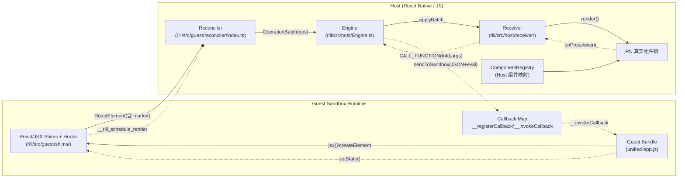
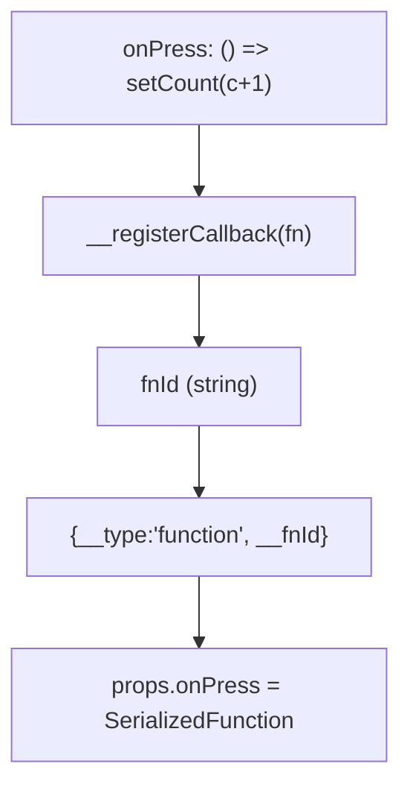
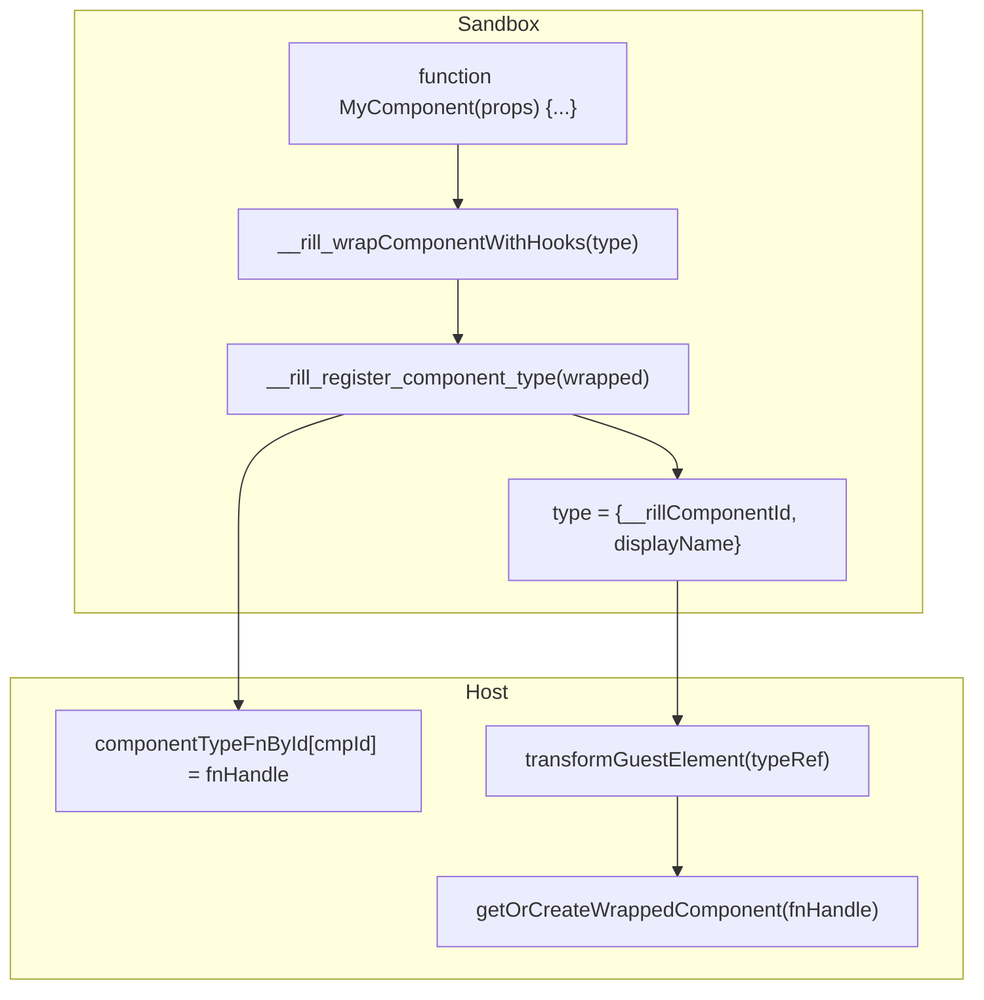
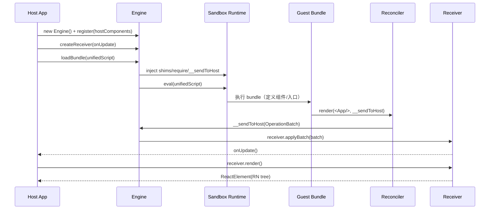
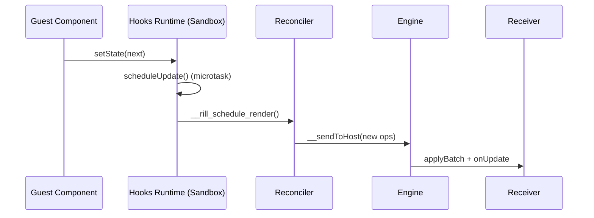
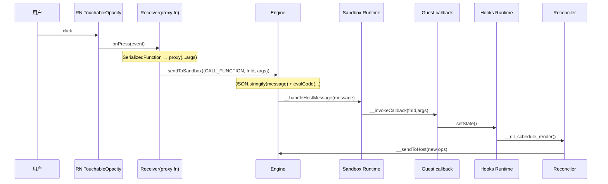
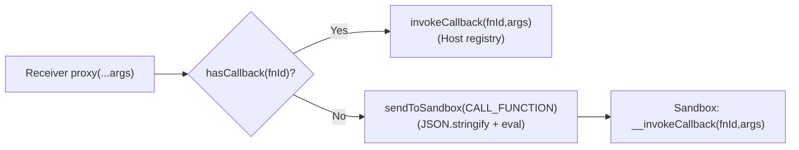

# Rill Guest ↔ Host 交互原理（渲染 / 更新 / 事件回调）

> 这份文档聚焦 **Rill 的 Guest（沙箱）与 Host（React Native）之间**如何完成：
> 1) 渲染（Guest 生成 UI → Host 渲染原生组件）
> 2) 更新（Guest 内部 state 变化 → Host 收到增量 ops 刷新 UI）
> 3) 事件回调（Host 侧点击等事件 → 触发 Guest 回调 → 再次渲染）
>
> 同时解释常见故障：例如 **`JSON.stringify cannot serialize cyclic structures` 导致按钮点击无效**。

---

## 0. TL;DR（30 秒版本）

- Guest 运行在一个隔离 JS Runtime（JSC/QuickJS/VM/Worker 等 Provider）里，靠注入的 **React/JSX shims** 构造“类 ReactElement”的对象树。
- 渲染时，**Reconciler（react-reconciler 自定义 renderer）**把 Guest 的 element 树转换成 **OperationBatch（ops 列表）**，通过 `__sendToHost(batch)` 发送给 Host。
- Host 的 **Receiver**把 ops 还原为一棵“可渲染的 RN 组件树”，交给 RN 渲染。
- Host 侧事件回调（如 `onPress`）不会直接跨引擎传函数，而是通过 `{__type:'function', __fnId}` 的“函数引用”回到 Guest 执行：
  - Host 调用 `sendToSandbox({type:'CALL_FUNCTION', fnId, args})`
  - Guest 侧执行 `__invokeCallback(fnId, args)`，回调里触发 `setState`
  - `setState` 通过 `__rill_schedule_render()` 请求重新渲染，再产出新 ops
- **关键约束**：当前 Host→Guest 消息通道用 `JSON.stringify(message)` 拼进 `eval(...)`，因此 `args/payload` 必须 **JSON 可序列化**；RN 的事件对象经常包含循环引用，直接作为参数会导致点击链路中断。

---

## 1. 角色与边界（谁在谁的进程/引擎里）

| 角色 | 所在侧 | 责任 | 典型实现位置 |
|---|---|---|---|
| Host App | RN/宿主 JS | 创建 Engine、注册组件、展示 UI、把点击等事件转回 Guest | `Canvas/Subsystem/src/askc-host/*`（项目集成） |
| Engine | Host | 管理 sandbox runtime、注入全局函数、执行 bundle、收发消息 | `rill/src/host/Engine.ts` |
| Receiver | Host | 接收 ops、维护 nodeMap、render 成 RN ReactElement、事件回调桥接 | `rill/src/host/receiver/` |
| Reconciler |（逻辑上）桥接层 | 把 element 树 → ops（CREATE/UPDATE/APPEND…） | `rill/src/guest/reconciler/index.ts` |
| Guest runtime | Sandbox | 执行 Guest bundle、保存 hooks 状态、运行回调 | `rill/src/guest/shims/`（注入）+ `unified-app.js` |

---

## 2. 两条“通信通道”（方向不同，约束不同）

### 2.1 Sandbox → Host：`__sendToHost(batch)`（高频、尽量无损）

- Guest/renderer 在 commit 阶段把 ops 打包成 `OperationBatch`。
- 通过 Host 注入到 sandbox 的函数 `__sendToHost` 直接回调到 Host（Provider/JSI 负责跨边界传参）。
- Host 收到后立即 `receiver.applyBatch(batch)`，再触发一次 `receiver.render()` 更新 UI。

### 2.2 Host → Sandbox：`sendToSandbox(message)`（低频，需经过参数清洗）

当前实现核心是"setGlobal + 按需 eval"：

```ts
// rill/src/host/Engine.ts（简化示意）
// CALL_FUNCTION: 优先使用 Host CallbackRegistry 直接调用，找不到时回退到 Guest
// HOST_EVENT: setGlobal 传递 payload，然后 eval 调用 Guest __handleHostEvent
const sanitizedArgs = sanitizeArgsForSetGlobal(message.args);
context.setGlobal('__payload', sanitizedArgs);
await evalCode(`__handleHostEvent("${eventName}", __payload)`);
```

**关键约束（`sanitizeArgsForSetGlobal`）：**
- 使用 JSON round-trip 避免触碰 HostObjects（会导致原生崩溃）
- 循环引用 → null
- 函数 → undefined
- Date → string（ISO 格式）
- Map/Set → `{}`（丢失）

**影响：**
- RN 原生事件对象（含循环引用）会被清洗为 null
- 需要手动提取必要字段（如 `event.nativeEvent.text`）再传递

> 如果你看到点击无响应，很可能是事件对象在清洗阶段丢失了关键信息。

---

## 3. 总体数据流（架构图）



---

## 4. 协议与序列化（最重要的“共同语言”）

### 4.1 渲染指令：`OperationBatch`（Sandbox → Host）

位置：`rill/src/shared/types.ts`

- `OperationBatch = { version, batchId, operations: Operation[] }`
- 常见 `Operation.op`：
  - `CREATE`：创建节点（组件类型 + props）
  - `APPEND/INSERT/REMOVE/REORDER`：维护父子关系
  - `UPDATE`：更新 props（含 `removedProps`）
  - `DELETE`：删除节点
  - `TEXT`：文本更新

示例（节选，展示形态）：

```json
{
  "op": "CREATE",
  "id": 12,
  "type": "TouchableOpacity",
  "props": {
    "style": { "padding": 12 },
    "onPress": { "__type": "function", "__fnId": "fn_abc_1" }
  }
}
```

### 4.2 函数序列化：`SerializedFunction`

位置：`rill/src/shared/types.ts`、`rill/src/guest/shims/`

当 Guest 给“Host 组件”（例如 `TouchableOpacity`）传函数 prop 时，会在 sandbox 内把函数注册到回调表：



> 这一步发生在 Guest 侧 `jsx()/createElement()` shim 中（见 `rill/src/guest/shims/`）。

### 4.3 Host 消息：`HostMessage`（Host → Sandbox）

位置：`rill/src/shared/types.ts`

| type | 含义 | 典型触发 |
|---|---|---|
| `CALL_FUNCTION` | 调用 Guest 回调 | 点击/输入等事件 |
| `HOST_EVENT` | Host 广播事件给 Guest | 可见性变化、backpressure、业务事件 |
| `CONFIG_UPDATE` | 更新 config | 宿主配置变更 |
| `DESTROY` | 销毁 engine | Tab 关闭/卸载 |

### 4.4 函数组件类型桥接：`__rill_register_component_type` / `{__rillComponentId}`

为什么需要它？
- Guest 侧的函数组件（`function App(){...}`）位于 sandbox 引擎里，`Symbol`/`$$typeof` 等信息跨边界可能丢失；
- 直接把函数组件当作普通 JS 值跨引擎传递，某些 Provider/JSI 组合下会“丢失可调用性”或产生不可预期的对象形态。

Rill 采用的做法：
- sandbox 注入一个 Host 函数：`__rill_register_component_type(fn) -> cmpId`
- Guest 在 `jsx()/createElement()` 时把函数组件注册到 Host，并用一个 **可序列化的 type 引用对象**替代真实函数：
  - `{ __rillComponentId: 'cmp_xxx', displayName?: string }`
- Host 在 `transformGuestElement()` 阶段看到该引用后，用 `cmpId -> fn` 的映射找回原始函数句柄，并生成一个稳定 wrapper 去调用它



---

## 5. 首次渲染：从 Guest bundle 到 RN 组件树（时序图）



你可以在日志里看到对应关键点：
- `Bundle loaded/executed`
- `__sendToHost ops=...`
- `Receiver.applyBatch(...)`
- `Receiver.render()`

---

## 6. 更新：Guest 的 `useState/useEffect` 如何触发重新渲染

位置：`rill/src/guest/shims/`

Guest hooks runtime 的核心思路：
- hooks 状态全部保存在 sandbox 内，避免跨引擎传递 `Date/Map/Function` 等对象
- `setState` 只改 sandbox 内的 state，然后 **安排一次 rerender**
- rerender 通过 Host 注入的 `__rill_schedule_render()` 或 `require('rill/reconciler').scheduleRender()` 触发



---

## 7. 事件回调：Host 点击如何“回到” Guest（时序图）



### 7.1 为什么点击容易"失效"（参数清洗导致数据丢失）

**现象：**
- UI 能正常渲染，但按钮点击没反应
- 或者回调执行了，但参数为 null/undefined

**根因：**
- RN 的 `onPress(event)` 会把一个 **事件对象 event** 作为参数传入
- Receiver 的 proxy 会把 `args=[event]` 传递给 `Engine.sendToSandbox()`
- `sanitizeArgsForSetGlobal()` 使用 JSON round-trip 清洗参数
- 事件对象含循环引用 → 清洗后变成 `null`
- Guest 回调接收到 `null`，无法获取必要信息

**解决方案：**
- 在 Host 侧（Receiver proxy）提取事件必要字段后再传递
- 或在 Guest 侧回调忽略参数，依赖内部 state

> 这就是"UI 看起来能渲染出来，但按钮点了没反应或拿不到数据"的典型模式。

### 7.2 回调执行的两条路径（直接调用 vs `CALL_FUNCTION`）

Receiver 在反序列化 `SerializedFunction` 时，会创建一个 proxy 函数。调用 proxy 时有两种可能：

1) **Host 侧可直接执行**（少数 Provider/场景）：fnId 对应的回调已在 Host 的 callback registry 中注册 → 直接 `invokeCallback(fnId, args)`，不走 `sendToSandbox`
2) **需要回到 sandbox 执行**（shims 模式下的常态）：fnId 是 Guest 侧 `__registerCallback` 生成的 → Host 不认识该 fnId → 必须 `sendToSandbox(CALL_FUNCTION)` 让 Guest `__invokeCallback` 执行



---

## 8. 常见坑与排查清单（结合真实日志）

### 8.1 Host→Guest 参数必须“JSON 友好”

避免把以下对象直接作为 `args/payload`：
- RN/DOM 事件对象（常见循环引用）
- 带原型链的大对象（例如包含函数、class 实例）
- `Error`（含不可序列化字段）
- `Map/Set`（会变成 `{}` 或丢失）
- `Date`（建议用 `number` 时间戳或 ISO 字符串）

### 8.2 Symbol/Fragment 的跨引擎问题（为什么要 marker）

JSI 边界上 **Symbol 无法可靠传递**，因此 shims 给 element 加了字符串标记：
- `__rillTypeMarker = '__rill_react_element__'`
- `__rillFragmentType = '__rill_react_fragment__'`

Host 在 `transformGuestElement()` 里用这些 marker 把 Guest element“重建”为 Host 可识别的 ReactElement。

入口：
- `rill/src/guest/shims/`（创建 element）
- `rill/src/guest/reconciler/index.ts`（`transformGuestElement`）

### 8.3 Fragment 只能有 `key/children`

Host 重建 Fragment 时必须丢弃其他 props，否则会触发：
`Invalid prop supplied to React.Fragment`

（这也是为什么 transform 阶段会“只保留 children”。）

### 8.4 UI 丢失/面板消失通常是“Guest 运行时异常”

你日志里出现过：
- `TypeError: b.map is not a function`
- `TypeError: n.getHours is not a function`

这种错误会导致 Guest 的某个组件 render 返回 `null`，最终表现为某个区域不再产出 ops 或被 DELETE。

---

## 9. 调试开关（让日志“说人话”）

### 9.1 打开 reconciler 采样日志

在 Host 进程（RN JS）里设置：

```js
globalThis.__RILL_RECONCILER_DEBUG__ = true;
```

会打印少量关键日志（例如 `add op`、`flush ops` 的采样），避免刷屏。

### 9.2 Receiver/Engine 的统计信号

代码里埋了若干全局计数（用于“确认链路有没有走到”）：
- `globalThis.__OP_COUNTS / __TOTAL_OPS`（reconciler flush 统计）
- `globalThis.__RECEIVER_FUNCTION_COUNT / __LAST_FUNCTION_FNID`（Receiver 反序列化函数次数）

对应文件：
- `rill/src/guest/reconciler/index.ts`
- `rill/src/host/receiver/`

---

## 10. 代码入口速查（读源码从这里开始）

- Engine：`rill/src/host/Engine.ts`
  - `loadBundle()` / `initializeRuntime()` / `sendToSandbox()`
  - 注入：`require`、`__sendToHost`、`__rill_schedule_render`
- Guest shims：`rill/src/guest/shims/`
  - React/JSX shims
  - hooks runtime + `__registerCallback` 的使用点
- Reconciler：`rill/src/guest/reconciler/index.ts`
  - `transformGuestElement()`（marker/Fragment/组件类型桥接）
  - `OperationCollector.flush()`（产出 OperationBatch）
- Receiver：`rill/src/host/receiver/`
  - `applyBatch()` / `render()` / `deserializeValue()`（回调 proxy）
- 协议类型：`rill/src/shared/types.ts`

---

## 11. 数据处理位置与职责分布（架构实现细节）

当前实现中，数据序列化/反序列化逻辑分散在不同位置，各有职责：

### 11.1 Guest → Host 方向（`__sendToHost`）

**位置：** `src/guest/reconciler/index.ts` - `serializePropsWithTracking()`

**职责：**
- 将 React elements 的 props 转换为 OperationBatch 中的序列化 props
- 函数类型 → `{__type: 'function', __fnId}`（注册到 CallbackRegistry）
- 嵌套对象/数组 → 递归序列化函数
- 循环引用检测（visited WeakSet）

**特点：**
- 不使用 bridge/serializer（自定义实现）
- 关注点：Guest component props → Host ops
- 传输通道：JSI 直接传递对象（零拷贝）

### 11.2 Host → Guest 方向（`sendToSandbox`）

**位置：** `src/host/Engine.ts` - `sanitizeArgsForSetGlobal()`

**职责：**
- 清洗 Host 侧参数，避免 HostObjects 导致原生崩溃
- 使用 JSON round-trip 强制序列化/反序列化
- 循环引用 → null，函数 → undefined，Date → string

**特点：**
- 不使用 bridge/serializer（JSON-based 实现）
- 关注点：避免原生崩溃，而非完整序列化
- 传输通道：setGlobal + 部分 eval

### 11.3 Host 内部（Receiver 反序列化）

**位置：** `src/host/receiver/Receiver.ts` - `deserializeValue()`

**职责：**
- 将 ops 中的序列化值转换为 React Native 可用的值
- `SerializedFunction` → proxy 函数（调用 sendToSandbox 或 Host registry）
- 递归处理嵌套对象/数组

**特点：**
- 不使用 bridge/serializer（自定义实现）
- 关注点：ops → RN component props
- 只处理 SerializedFunction，其他值直接传递

### 11.4 Bridge/Serializer（通用序列化层）

**位置：** `src/shared/serializer.ts` - `ValueSerializer`

**职责：**
- 提供完整的序列化/反序列化 API
- 支持特殊类型（Date, RegExp, Error, Map, Set）
- 循环引用检测，深度限制

**特点：**
- 主运行时路径**未使用**
- 只在 DevTools 中使用
- 设计为通用序列化层，但未集成到核心流程

### 11.5 为什么是分散的？

**设计考量：**
1. **性能优化：** JSI 可以零拷贝传递对象，无需完整序列化
2. **职责分离：** Reconciler 关注 Guest → Host，Receiver 关注 Host 内部，Engine 关注崩溃防护
3. **最小化开销：** 只序列化必须序列化的（函数），其他直接传递
4. **历史演进：** Bridge/Serializer 是后来添加的，核心路径已经稳定

**潜在问题：**
- 逻辑分散，维护成本高
- 重复实现（三个地方都有递归序列化逻辑）
- 特殊类型处理不一致（Date/Map/Set 在 Bridge 支持，但 Reconciler/Receiver 不用）

## 12. 一个建议的"约束模型"（写 Guest 更稳）

如果你在写 Guest（unified-app）侧代码，推荐遵循：
- state 放在 Guest 内（useState），跨 Host 的数据尽量用 **JSON 基本类型** 表达
- 事件回调不要依赖 RN event 对象（或主动提取你需要的最小字段）
- 需要传给 Host 的 payload（`__sendEventToHost`/`HOST_EVENT`）也只用 JSON 可序列化结构
- 避免在 props 中传递 Date/Map/Set/Error 等特殊类型（会被序列化为普通对象或字符串）
